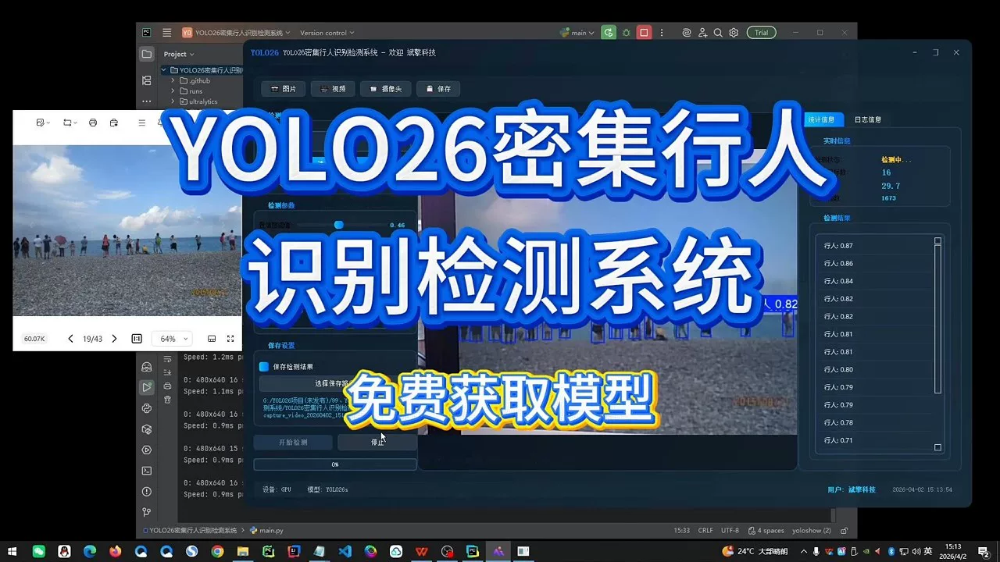
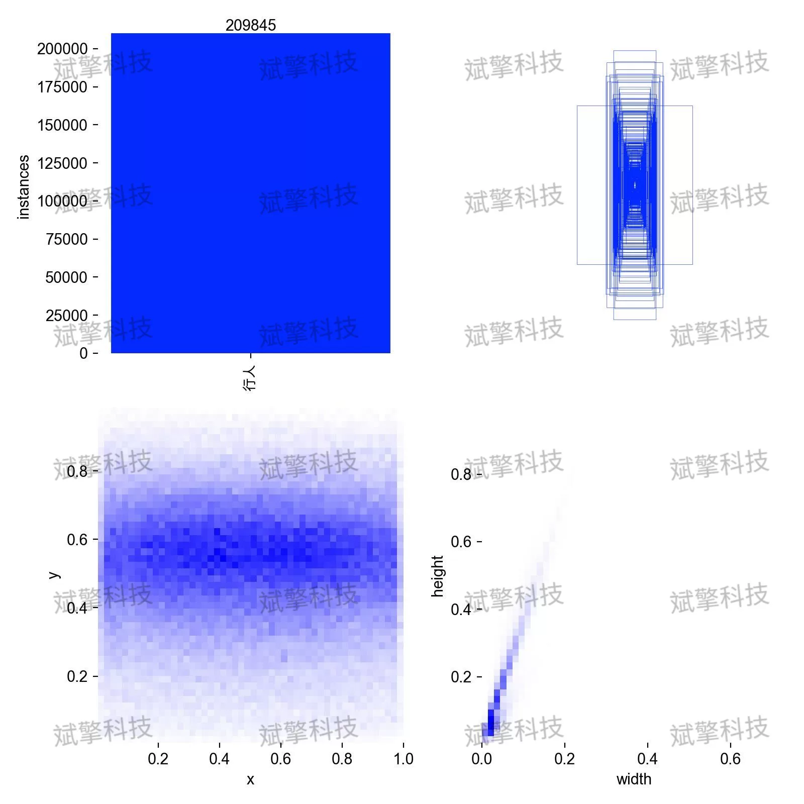
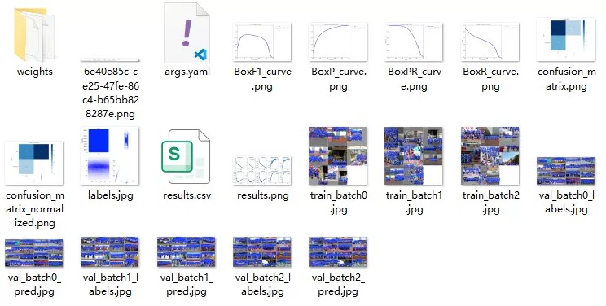
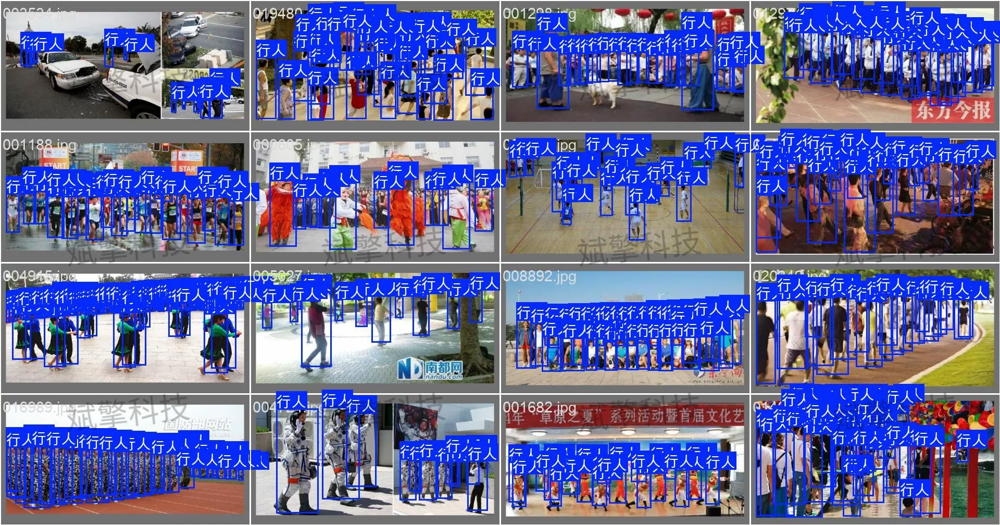
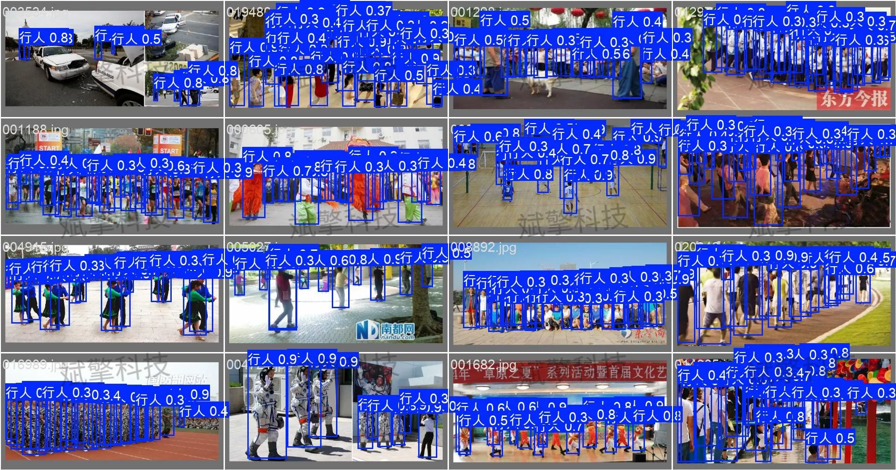
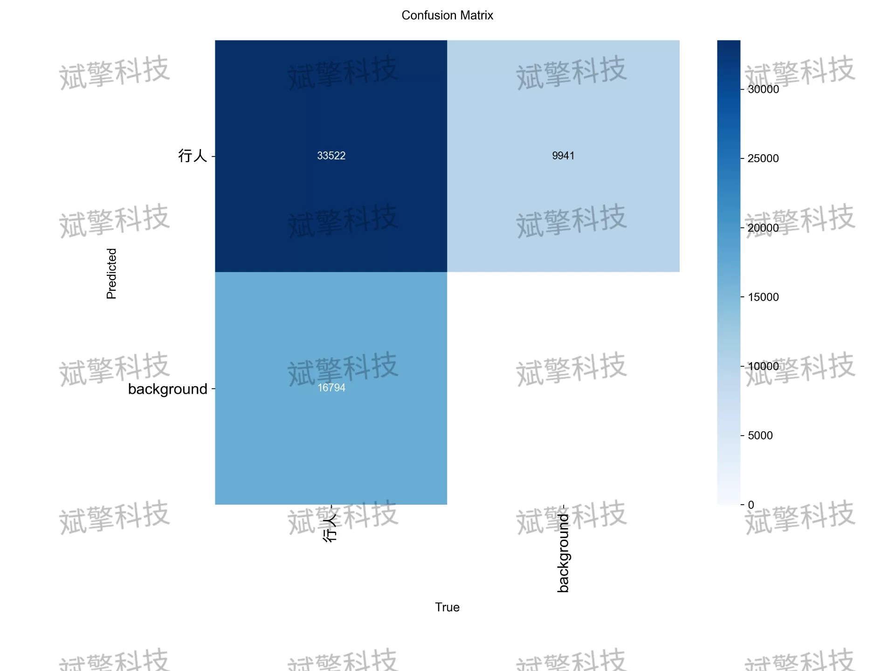
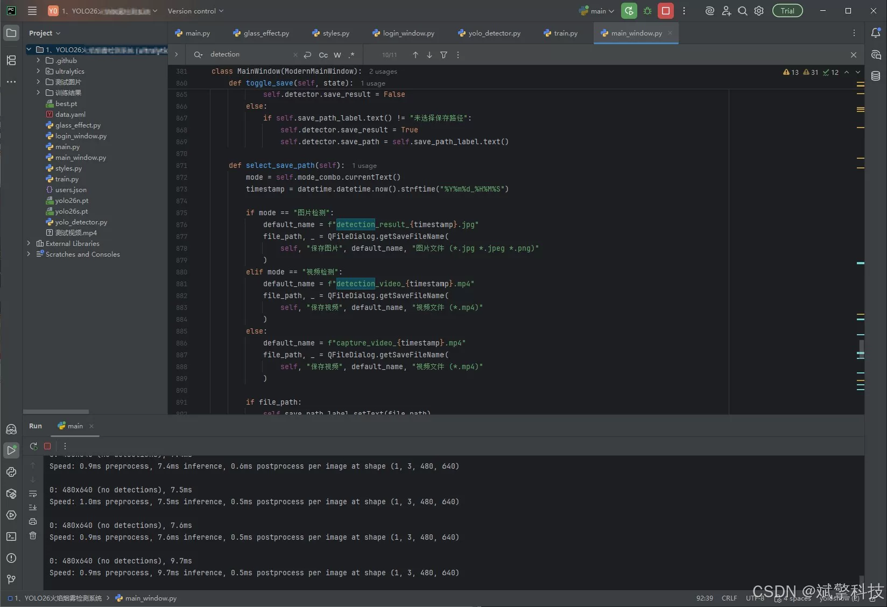
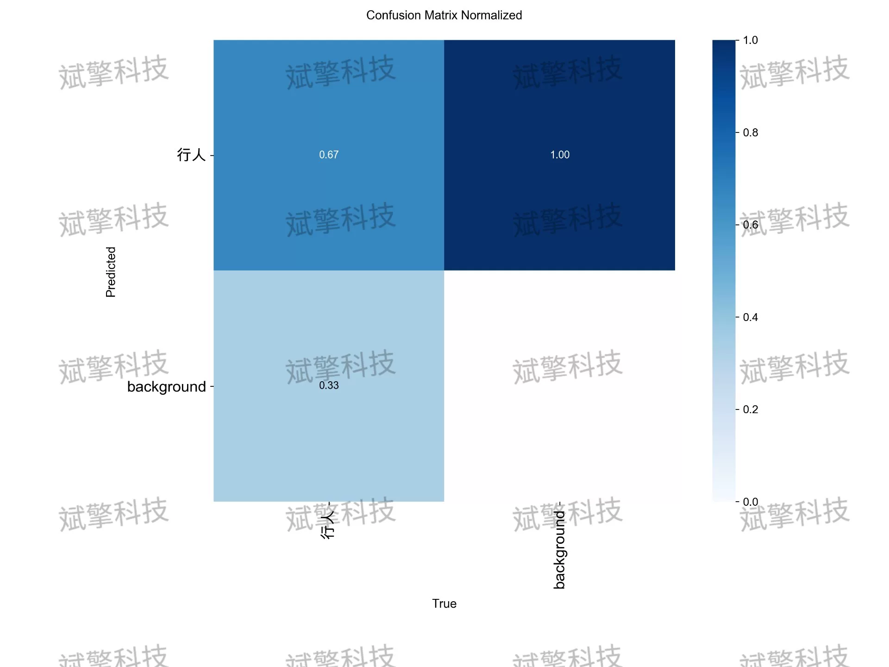

# YOLOv26 dense pedestrian detection system | source code + model

## Body

YOLO26 Dense Pedestrian Detection System | Source Code + Model YOLO26 Dense Pedestrian Recognition and Detection System (Project Source Code + Dataset + Model Weights + UI Interface + Python + Deep Learning + Remote Environment Deployment)

In response to the severe issues of severe occlusion, small target size, and high missed detection rate in dense scene pedestrian detection, this paper constructs a dense pedestrian recognition and detection system based on the YOLO26 framework. The system targets a single category (pedestrian) for detection, using 7200 images for training and 1800 images for validation.

The dataset only contains one target category - pedestrian (person), corresponding to the configuration file's nc: 1 and names: ['person']. Using a single-category design can eliminate the interference of other objects, allowing the model to focus on learning pedestrian features, facilitating targeted analysis of the detection bottleneck in dense scenes.

Free appointment for remote installation. Unsuccessful installation will result in a full refund.
Purchase comes with the following resources (auto unlocked in Baidu Pan):
   - Complete source code of the YOLO recognition and detection project
   - YOLO format dataset
   - Training code + UI interface code
   - Trained model + results image
   - Software installation package
   - Add WeChat to make an appointment for remote installation (automatically display WeChat ID after purchase) - Unsuccessful, full refund

⚙️ Core Functional Modules
Detection Capability
    Image Detection: Upon upload, return detection boxes + category information
    Video Detection: Support video files, analyze accurately per frame
    Camera Real-time Detection: Integrate USB camera for dynamic monitoring
Interaction and Control
    Target Filtering: Choose one or more categories for detection
    Parameter Real-time Adjustment: Adjustable confidence threshold & IoU threshold, flexible control accuracy
    Result Save: One-click save of images/videos/camera detection results
System and Data
    User registration and login: Support password strength check + encryption storage
    Log recording: Automate operation and error information recording (with timestamp)

## Images

## Payment

Here is a pay link on Stripe ( https://buy.stripe.com/3cs8yP7sY87d0vu9AB ). Please contact me lonlonago@foxmail.com after funding $89, and I will send you a complete data files , thank you!

